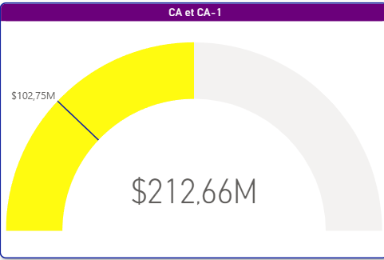

# Commercial Performance Analysis – Power BI

## Background & Overview

Ce projet a pour objectif d’analyser la performance commerciale d’une entreprise à travers ses ventes, ses produits et son réseau de boutiques.
Les données disponibles couvrent plusieurs dimensions (temps, produits, catégories, boutiques, zones géographiques) mais nécessitent une structuration et une analyse afin de produire des informations réellement exploitables.

En tant que Data Analyst, l’objectif est de transformer ces données en insights clairs permettant :

* de suivre la performance globale,
* d’identifier les principaux leviers de chiffre d’affaires,
* de mettre en évidence les zones de concentration et de risque,
* de soutenir la prise de décision business.

L’analyse est restituée via des tableaux de bord interactifs Power BI.

---

## Data Structure Overview

Le modèle de données repose sur plusieurs domaines fonctionnels :

* **Ventes** : dates, quantités vendues, chiffre d’affaires, comparaisons N vs N-1
* **Produits** : produits, catégories, sous-catégories, marques, classes de produits
* **Boutiques** : boutiques, types, statuts (actif/inactif), pays et régions
* **Tables de référence** (ex. prix) intégrées directement dans le modèle Power BI

Les tables sont reliées afin de permettre des analyses croisées par période, produit et point de vente.
Des contrôles de cohérence ont été réalisés avant l’analyse pour garantir la fiabilité des résultats.

---
## Executive Summary – Visual Overview

### 1) Chiffre d’affaires global et comparaison CA vs N-1
Ce graphique présente le chiffre d’affaires global ainsi que sa comparaison avec l’année précédente (CA-1).
Le chiffre d’affaires total atteint 212,66 M, contre 102,75 M pour la période précédente, ce qui indique une évolution positive de la performance commerciale.

  

---

### 2) Répartition du chiffre d’affaires par catégorie produit

Ce graphique présente la répartition du chiffre d’affaires par catégorie de produit.  
La catégorie **Computers** représente environ **57 %** du chiffre d’affaires total, suivie par **TV and Video** (environ **24 %**) et **Cell Phones** (environ **14 %**). 
Les autres catégories contribuent de manière plus limitée au chiffre d’affaires global.

  

---

### 3) Répartition des boutiques par statut (actives vs inactives)

